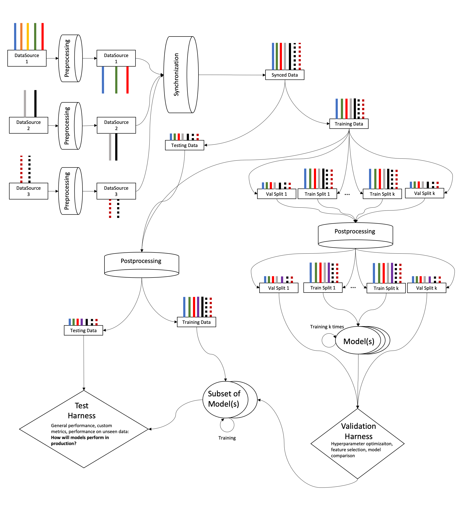

# Pipeline

The Nowcast Library Pipeline is intended as a holistic yet modular system for
processing and synchronizing data, fitting models to it, and evaluating these
models.

## Structs

The `nowcastlib.pipeline` submodule includes the `nowcastlib.pipeline.structs`
module. These are custom classes that serve as skeletons for configuration
options for setting up the various pipeline steps.

## Processing

The Nowcast Library Pipeline categorizes data processing in two types:

- **preprocessing**: processing applied that is corrective and/or filter-like in
  nature
- **postprocessing**: processing applied that is additive or trasformative in
  nature
  - this includes any sort of feature selection

## Synchronization

Synchronization refers to the process of temporally aligning data originating
from multiple sources with different sample rates and operational time ranges.

The simplest edge case requiring non-trivial synchronization is when the sources
operate at roughly the same sample rate and at the same times almost
continuously, but for longer and shorter periods. In this case we simply have to
resample to a single sample rate and find the latest start period and earliest
end period across the data sources.

On the opposite end we have the edge case where each data source has its own
sample rate and presents large gaps of different sizes at different times. In
this case a synchronization process would want to keep the data only when all
data sources overlap. This leaves large chunks between overlaps, as well as
smaller ones due to differences in sample rates.

Handling the latter of these two edge case allow us to handle all other cases in
between. As such, besides the target sample rate, the user needs to specify
additional configuration options under the `chunk_config` of the `SyncOptions`
struct.
