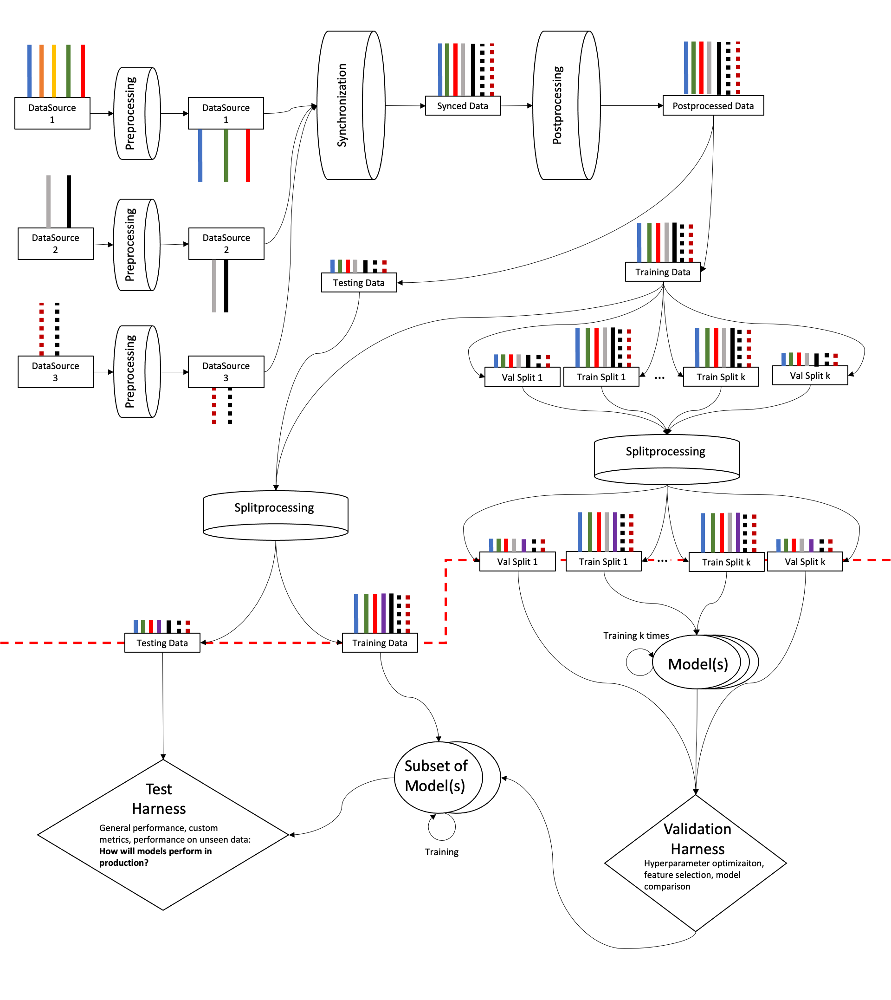

# Pipeline

The Nowcast Library Pipeline is intended as a holistic yet modular system for
processing and synchronizing data, fitting models to it, and evaluating these
models.

While these steps are modular and hence able to be run independently, in
practice the pipeline is intended to be run into 2 main steps:

1. data wrangling
2. model training and evaluation

The dashed red line indicates the boundary between the two steps, with the
output of the data wrangling step being fed into the model training and
evaluation step.

## Structs

The `nowcastlib.pipeline` submodule includes the `nowcastlib.pipeline.structs`
module. These are custom classes that serve as skeletons for configuration
options for setting up the various pipeline steps. To use the pipeline and any
sub-pipeline within, users will use the top level `DataSet` class to specify
their configuration, with the other structs being specified within.
Configuration is intended to be provided in JSON format via a .json file.
Example configuration files can be found in the
[examples folder on github](https://github.com/thesofakillers/nowcastlib/tree/master/examples)
under the naming convention `pipeline_{cli subcommand}.json`

## Data Wrangling

The data wrangling "step" takes a set of data sources and outputs the resulting
synchronized and processed data, organized in train, test and train-validation
splits to feed into the model training and evaluation step. This step includes
the following sub-pipelines, shown here in their intended order of execution.

1.  preprocessing
2.  synchronization
3.  postprocessing

While each of these steps can be run independently of the others, each step will
implicitly run the processes of the previous steps leading up to it. For
example, if the user were to run a postprocessing subroutine, the pipeline will
also run the preprocessing and synchronization steps leading up to it. Of
course, if the configuration is minimal for these implicit previous steps, then
the actual processing itself will also be kept to a minimum.

Future iterations of the pipeline will aim to implement caching to avoid
repeating previously computed processes.

### Processing

The Nowcast Library Pipeline categorizes data processing in two types:

-   **preprocessing**: processing applied that is corrective and/or filter-like
    in nature
-   **postprocessing**: processing applied that is additive or trasformative in
    nature

### Synchronization

Synchronization refers to the process of temporally aligning data originating
from multiple sources with different sample rates and operational time ranges.

The simplest edge case requiring non-trivial synchronization is when the sources
operate at roughly the same sample rate and at the same times almost
continuously, but for longer and shorter periods. In this case we simply have to
resample to a single sample rate and find the latest start period and earliest
end period across the data sources.

On the opposite end we have the edge case where each data source has its own
sample rate and presents large gaps of different sizes at different times. In
this case a synchronization process would want to keep the data only when all
data sources overlap. This leaves large chunks between overlaps, as well as
smaller ones due to differences in sample rates.

Handling the latter of these two edge case allow us to handle all other cases in
between. As such, besides the target sample rate, the user needs to specify
additional configuration options under the `chunk_config` of the `SyncOptions`
struct.

## Model Training and Evaluation (Not yet available)

The model training and evaluation "step" is concerned with 3 general processes,
reliant on the

-   Model fitting
    -   including a preliminary and optional feature selection stage
-   Model performance validation:
    -   to select hyperparameters
    -   to compare and select multiple models
-   Model performance evaluation
    -   to estimate how the selected models will perform in production
